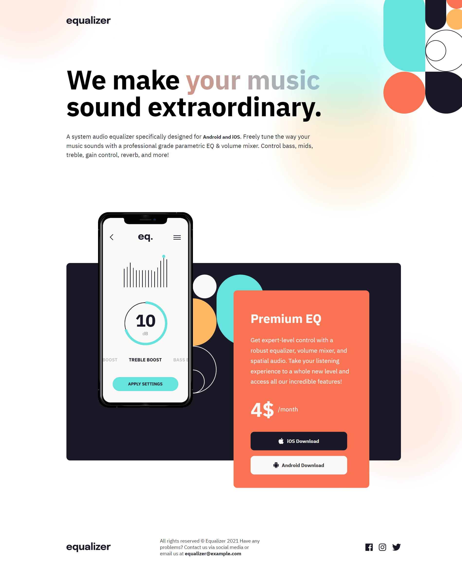

# Frontend Mentor - Equalizer landing page

This is a solution to the [Equalizer landing page challenge on Frontend Mentor](https://www.frontendmentor.io/challenges/equalizer-landing-page-7VJ4gp3DE). Frontend Mentor challenges help you improve your coding skills by building realistic projects. 

### Screenshot

### Links

- Solution URL: [Frontend Mentor Solution](https://www.frontendmentor.io/solutions/social-proof-section-pure-css-grid-custom-hover-states-KwSrl-Rjws)
- Live Site URL: [Live Site at Vercel](https://equalizer-landing-page-2.vercel.app/)
## My process

### Built with

- Semantic HTML5 markup
- BEM
- Grid
- Responsive Design

### What I learned

I learned how to position two images as background and move them across the page, the same thing about the hero section of this page where there was a card and a phone photo with custom positions. Most important was to see how those elements behave across the different screen sizes and how to set the screen breakpoints to match the design.

### Useful resources

- [BEM 101](https://sparkbox.com/foundry/bem_by_example) - BEM 101

